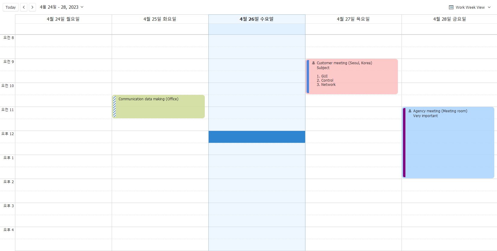
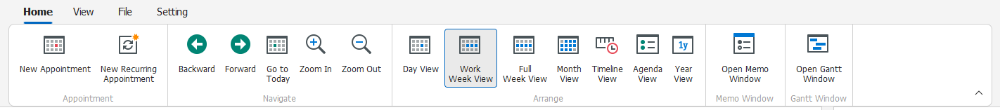
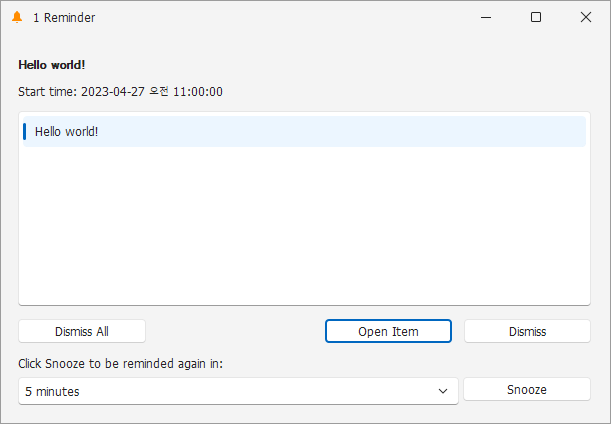
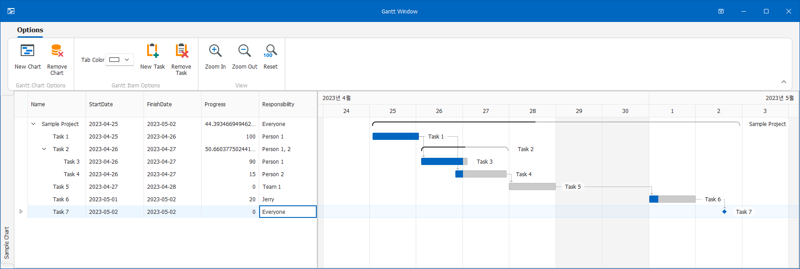
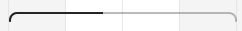
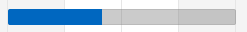
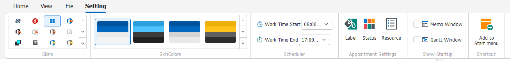
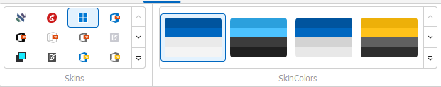
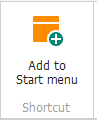

# Personal Planner

Copyright : © ClockStrikes

Homepage : https://peponi-paradise.tistory.com/

Github : https://github.com/peponi-paradise

 

## 1. SW Introduction

 

- 해당 SW의 목적은 업무 관리 효율 향상에 있습니다.
- PersonalPlanner의 주요 기능은 아래와 같습니다.
    |Item|Description|
    |---|---|
    |Schedule|Schedule planner|
    |Memo|Simple memo|
    |Gantt chart|Gantt chart|

- SW 제작에 사용된 언어는 C#, 버전은 10입니다.
- GUI는 Winform, [DevExpress](https://www.devexpress.com/)를 이용하여 제작되었습니다.
- GUI는 스케줄러를 메인 화면으로 하며 메모, 간트 차트 기능을 개별 화면으로 제공하고 있습니다.
    
- SW 버전 이력은 `VersionHistory.md` 파일을 통해 확인 가능합니다.

 

## 2. Schedule

 

### 2.1. 화면 구성

 

- 스케줄러의 화면 구성은 아래와 같습니다.
     
    1. Menu : 보기, 설정 등
    2. Schedule : 스케줄 표기
    3. Calendar : 멀리 떨어진 날짜 이동에 사용

 

### 2.2. 사용 방법

 

#### 2.2.1. 스케줄 설정

 

- 스케줄을 추가하기 위한 방법은 아래와 같습니다.
    1. 메뉴를 이용한 추가
        
    2. Schedule을 추가하고 싶은 곳 더블 클릭
        
    3. Schedule을 추가하고 싶은 곳 클릭 후 `엔터 키` 누름 또는 내용 입력
        
- 스케줄 설정 / 변경 방법은 아래 설명을 참조합니다.
     
     
    
    |항목|설명|
    |---|---|
    |Label|스케줄의 배경 색상|
    |Show time as|`Status`. 스케줄의 옆에 해당 레이블이 표시|
    |Resource|해당 항목을 통해 일정 카테고리화|
    |Reminder|시간 알림 설정  ex) 15 minutes : 15분 전 알림|
    |Recurrence|반복 설정|
    |Subject|주제|
    |Location|장소. `Subject` 옆에 `(Location)` 표시됨|
    |Bottom box|Description 입력|

    - 스케줄러는 `드래그 & 드롭` 기능을 지원합니다. 드래그하여 일정 변경이 가능합니다.

 

#### 2.2.2. 스케줄 화면 변경

 

- 상단 메뉴 `Home` 탭 또는 `View` 탭을 통해 보기 방식을 변경할 수 있습니다.
     
    

 

#### 2.2.3. 스케줄 알림

 

- 스케줄 설정 시 `Reminder` 항목을 기입한 경우, 지정 시간이 되면 아래와 같은 알림창이 발생합니다.
    
 

- `시작 메뉴`에 바로가기 등록이 되어 있는 경우, 윈도우 알림 기능이 활성화되어 추가 알림이 발생합니다.
    
    - SW 최초 실행 시 바로가기 등록 여부를 사용자에게 문의합니다.
    - 나중에 추가를 원하는 경우, [5.5. 시작메뉴 바로가기](#55-시작메뉴-바로가기)를 참조합니다.

 

#### 2.2.4. Label, Status, Resource 아이템 추가

 

- [5.3. 스케줄 구성 요소 설정](#53-스케줄-구성-요소-설정) 항목 참조

 

## 3. Memo

 

- 탭으로 메모를 분리하여, 각각의 메모를 작성할 수 있습니다.
    
    - 각각의 탭마다 컬러 및 폰트 설정이 가능합니다.

 

## 4. Gantt chart

 

- 탭으로 구분된 여러 개의 간트 차트 그리기 기능을 지원합니다.
    
    - `Tab Color`를 통해 탭의 색상을 지정할 수 있습니다.
    - `New Task`, `Remove Task`를 통해 간트 아이템을 추가, 제거할 수 있습니다.
    - 상단의 `View` 옵션을 통해 오른쪽 차트 영역의 줌 설정이 가능합니다 (`Ctrl + 마우스 휠`)

 

### 4.1. Tree view area

 

- `드래그 & 드롭` 기능을 지원하여, 각 항목을 다른 항목의 하위에 위치시키거나 순서 변경이 가능합니다.
- 각 항목을 `더블 클릭`하면 세부 설정 창이 나타나며 항목 수정이 가능합니다.
- 상위 항목의 `Progress`는 하위 항목의 `Progress` 값에 따라 결정됩니다.
- 각 열에 대해 `정렬`, `필터` 기능을 지원합니다.
- 불필요한 열을 드래그 하여 제거할 수 있습니다. `열 우클릭` 후 `Column chooser`를 선택하여 다시 복원할 수 있습니다.
    

 

### 4.2. Gantt view area

 

- `Tree view area`의 데이터를 기반으로 그려줍니다.
- `Dependency` 기능을 탑재하여, 각 항목간 순서 관계를 화살표로 명확히 할 수 있습니다.
- `드래그 & 드롭` 기능을 지원하여, 항목별 기간 변경이 가능합니다. 
- 상위 항목을 이동하는 경우, 하위 항목도 같이 이동합니다.
- 항목의 기간을 연장하거나 줄이는 경우, 하위 항목 또는 상위 항목의 기간 변경은 없습니다.
- 항목 내부를 드래그하여 `Progress` 값을 수정할 수 있습니다.
- View의 구성요소는 아래와 같습니다.
    |Item|Description|
    |:---:|---|
    ||상위 항목|
    ||항목|
    ||Milestone|
    ||Dependency line|

 

## 5. SW 설정

 

- [Schedule window](#2-schedule)의 Setting 메뉴를 이용해 SW 설정이 가능합니다.

 

### 5.1. Skin 설정

 

- 좌측의 `Skins`를 통해 스킨 모양을 설정합니다.
- 우측의 `SkinColors`를 통해 스킨 색상을 지정합니다.

 

### 5.2. Work time 설정

 

- 업무 시간을 설정합니다. 
- 스케줄러, 간트 뷰와 연동됩니다.

 

### 5.3. 스케줄 구성 요소 설정

 

- 스케줄 구성 요소를 설정합니다.
- 각 항목을 클릭하면 새로운 창이 나타나 이름과 스타일 지정이 가능합니다.

 

### 5.4. SW 스타트업 설정

 

- SW 시작 시 보기 설정입니다.
- 체크할 시 SW를 실행할 때 자동으로 window를 열어줍니다.

 

### 5.5. 시작메뉴 바로가기

 

- 시작메뉴에 바로가기를 등록합니다.
- 이미 등록되어 있을 시, 해당 메뉴가 보이지 않습니다.
- 스케줄에 대해 `Windows 알림` 기능을 이용하고 싶은 경우 시작메뉴에 바로가기 아이콘이 추가되어 있어야 합니다.