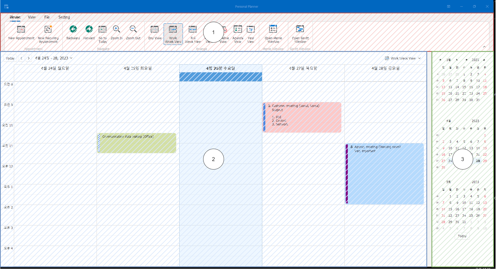

# Personal Planner

Copyright : © ClockStrikes

Homepage : https://peponi-paradise.tistory.com/

Github : https://github.com/peponi-paradise

 

## 1. SW Introduction

 

- 해당 SW의 목적은 업무 관리 효율 향상에 있습니다.
- PersonalPlanner의 주요 기능은 아래와 같습니다.
    |Item|Description|
    |---|---|
    |Schedule|Schedule planner|
    |Memo|Simple memo|
    |Gantt chart|Gantt chart|

- SW 제작에 사용된 언어는 C#, 버전은 10입니다.
- GUI는 Winform, [DevExpress](https://www.devexpress.com/)를 이용하여 제작되었습니다.
- GUI는 스케쥴러를 메인 화면으로 하며 메모, 간트 차트 기능을 개별 화면으로 제공하고 있습니다.
    
- SW 버전 이력은 `VersionHistory.md` 파일을 통해 확인 가능합니다.

 

## 2. Schedule

 

### 2.1. 화면 구성

 

- 스케쥴러의 화면 구성은 아래와 같습니다.
     
    1. Menu : 보기, 설정 등
    2. Schedule : 스케쥴 표기
    3. Calendar : 멀리 떨어진 날짜 이동에 사용

 

### 2.2. 사용 방법

 

- 스케쥴을 추가하기 위한 방법은 아래와 같습니다.
    1. 메뉴를 이용한 추가
        
    2. Schedule을 추가하고 싶은 곳 더블 클릭
        
    3. Schedule을 추가하고 싶은 곳 클릭 후 `엔터 키` 누름 또는 내용 입력
        
- 스케쥴 설정 방법은 아래 설명을 참조합니다.
     
     
    - Label : 스케쥴의 배경 색상에 사용됩니다.
    - Show time as : `Status`를 나타냅니다. 스케쥴의 옆에 해당 레이블이 표시됩니다.
    - Reminder : 시간 알림 설정입니다. ex) 15 minutes : 15분 전 알림
    - 